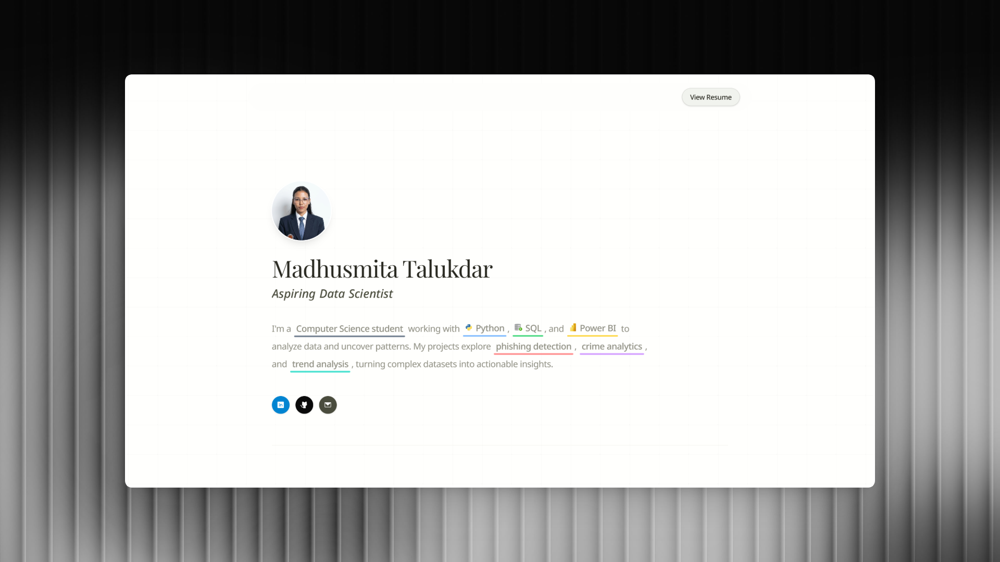

# Premium Data Science Portfolio

A minimalist, highly interactive portfolio designed for data science and analytics professionals. Built with React, Tailwind CSS v4, and Framer Motion, it features sophisticated Awwwards-inspired animations, glassmorphism UI elements, and a responsive grid layout.



## 🚀 Features

- **Cinematic Animations**: Staggered 3D text flips, smooth scroll reveals, and magnetic buttons powered by Framer Motion.
- **Glassmorphism Aesthetic**: Deep blurring, frosted glass panels, and ambient background orbs.
- **Advanced UI Interactions**: 
  - Dynamic highlight effects on text blocks
  - Custom CV viewer portal (no forced downloads)
  - Seamless animated hover states on projects and skills
- **Responsive Design**: Flawless scaling from mobile to 4K displays.
- **Data-Driven Architecture**: All portfolio content (projects, skills, resume) is centrally managed in `src/data/portfolioData.js`.

## 🛠️ Built With

- **React 18**
- **Vite**
- **Tailwind CSS v4** (Utility-first styling & layout)
- **Framer Motion** (Production-ready declarative animations)
- **Phosphor Icons**

## 📦 Getting Started

### Prerequisites

- Node.js (v16.x or later)
- npm or yarn

### Installation

1. Clone the repository:
   ```bash
   git clone https://github.com/yourusername/portfolio.git
   cd portfolio
   ```

2. Install dependencies:
   ```bash
   npm install
   ```

3. Start the development server:
   ```bash
   npm run dev
   ```

4. Open your browser and navigate to `http://localhost:5173`.

## 📂 Project Structure

```text
├── public/                 # Static assets (images, icons, CV pdf)
├── src/
│   ├── components/         # Reusable UI components & layouts
│   │   ├── sections/       # Main page sections (Hero, Projects, Skills, etc.)
│   ├── data/               # Centralized data source (portfolioData.js)
│   ├── index.css           # Global styles and Tailwind configuration
│   ├── App.jsx             # Main application component
│   └── main.jsx            # Entry point
```

## 🎨 Customization

To personalize the portfolio:
1. Open `src/data/portfolioData.js`.
2. Update the `hero`, `about`, `skills`, `projects`, `education`, `certificates`, and `awards` objects with your own information.
3. Replace the images and icons in the `public/` directory with your own assets.

## 📄 License

This project is open-source and available under the [MIT License](LICENSE).
